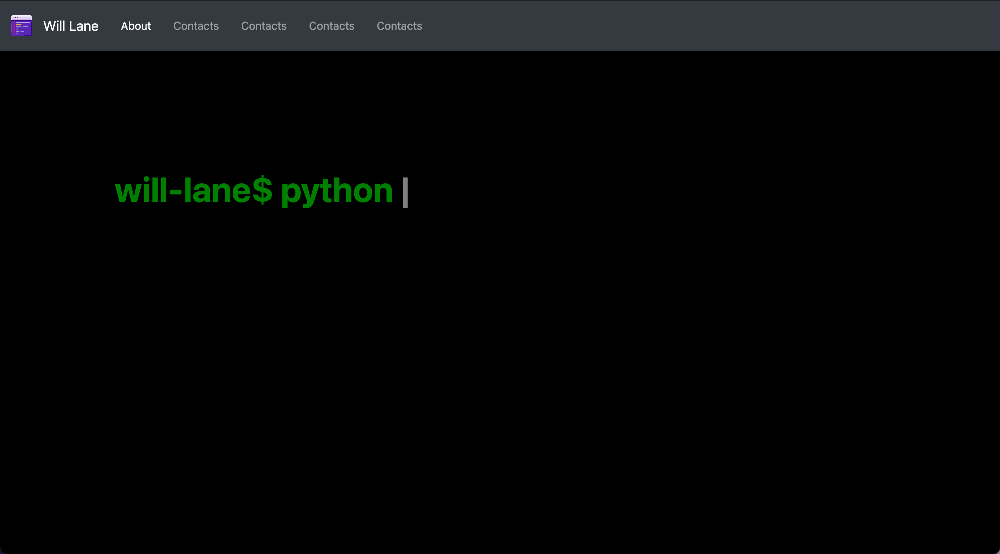

# Will Lane portfolio site


[](https://github.com/willdoescode/react-portfolio-website/graphs/commit-activity)
[](https://www.will.tools)

[](https://lbesson.mit-license.org/)
[](https://confluence.jetbrains.com/display/ALL/JetBrains+on+GitHub)


## Project Screen Shot(s)



## Installation and Setup Instructions

#### Clone this repository and enter the directory:

```bash
git clone https://github.com/willdoescode/react-portfolio-website
cd react-portfolio-website
```

#### Installation:

```bash
npm install
```

#### Start the development server"

```bash
npm start
```

Visit the development server:

`localhost:3000`

## Testing

```bash
npm run test
```

## Building

```bash
npm run build
```
